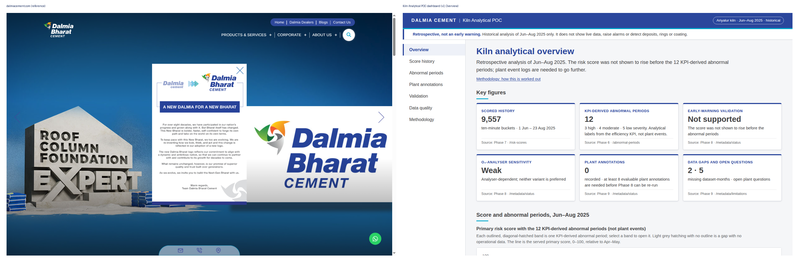
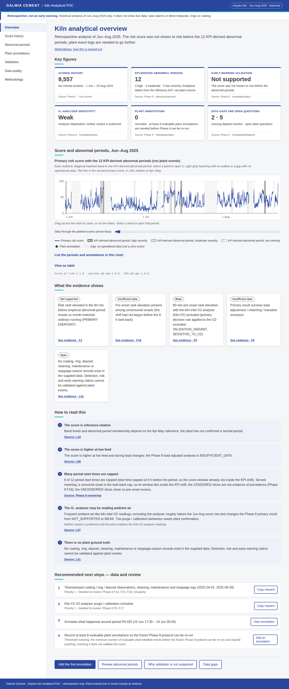

# Phase 10 — Multi-page analytical dashboard (v2)

## 1. Executive summary

A seven-page retrospective dashboard for the Ariyalur kiln POC, served beside the frozen Phase 9 API. It shows:
- historical scores and KPI-derived abnormal periods (not plant events);
- plant annotations;
- the Phase 8 `NOT_SUPPORTED` result;
- data-quality metadata.

It does not compute a score, raise warnings or show live data.

v2 rebuilt v1 (`182ef71`, `649f691`) on the dalmiacement.com theme. Every page now follows the same section rhythm, and every number is a link to its evidence. It works locally and as a read-only GitHub Pages copy. Seven reviews ran in step 9, and every finding is fixed or accepted with a reason (`reviews/REVIEW_LOG.md`).

## 2. Dashboard objective

Give an analyst the Phase 9 evidence in one place:
- what the POC measured;
- what Phase 8 did not support, and why;
- which data would let it be re-tested;
- a way to record plant annotations for that re-test.

It is not a live monitor.

## 3. Stack decision

Plain HTML, CSS and ES modules, with no build step and no npm dependency. `serve.py` (stdlib) serves `public/` and proxies `/api/…`, `/health` and `/ready` to Phase 9 at `127.0.0.1:8009`. It adds a Host check, an Origin check on writes, a body-size limit, a hash-based CSP and anti-framing headers.

Charts are inline SVG (`public/js/chart.js`). On `*.github.io`, `snapshot.js` answers GET requests from exported JSON and refuses writes with 405.

## 4. Dalmia design reference

Tokens were sampled from https://www.dalmiacement.com/ (now Dalmia Bharat Cement):
- navy `#2a469c`;
- cyan `#00a8ce`, used only for the header stripe and the section-heading rule;
- charcoal `#414142`;
- Arimo, falling back to Arial.

v1's green and orange were not from the site and are retired. No logo, imagery, markup or script was copied. The header uses a text wordmark.

Brand colours never encode a data state. Severity, status and coverage use a neutral ramp plus text and pattern. Details and contrast checks are in `docs/DESIGN_SYSTEM.md`. The theme side-by-side is below.

## 5. Information architecture

Header wordmark → sticky disclaimer ("Retrospective, not an early warning…") → left nav (top tabs under 900 px) → page. Every page follows hero (title and a one-sentence answer) → KPI cards → graph → insights → advisory → next steps → action bar. Client wording lives in `public/js/copy.js`.

## 6. Page inventory

| Path | Page | Answers |
|---|---|---|
| `/` | Overview | What the POC shows and does not, with the score strip and the 12 periods |
| `/history` | Score history | The score over any range, gaps, the optional O₂-excluded sensitivity overlay, and periods and annotations |
| `/abnormal-periods`, `/abnormal-periods/P6-0NN` | Abnormal periods | The 12 KPI-derived periods (not plant events), a timeline, and a detail panel with "View on trend" and "Annotate this period" |
| `/events`, `/events/new`, `/events/<id>`, `/events/<id>/edit` | Plant annotations | Calendar, list, create, edit, withdraw and the audit trail |
| `/validation` | Validation | The Phase 8 primary endpoint (`NOT_SUPPORTED`), the O₂ check (Weak; neither variant preferred), capped start times, negative controls and findings |
| `/data-quality` | Data quality | Coverage matrix, limitations L01–L13 and open plant questions |
| `/methodology` | Methodology | The phase chain and the analytical boundary |

Deep links and anchors (for example `#F3`, `#L07`, `#censoring`, a coverage cell) survive reload and back/forward, in path mode locally and hash mode on Pages.

## 7. API integration

See `docs/API_INTEGRATION.md`. Windows use the API's `start`, `end`, `limit` and `offset`, and `getAll` pages through until `next_offset` stops advancing. The snapshot (`scripts/export_snapshot.py`) exports the same responses. It leaves out the test actors (`e2e.journey`, `poc.analyst`), so the hosted copy has 0 annotations.

## 8. Analytical semantics

See `docs/UX_SEMANTICS.md` and `reviews/ANALYTICAL_REVIEW.md`.
- Every figure is served; the client counts and thins points for drawing but never computes a statistic.
- Periods are always "KPI-derived abnormal periods (not plant events)".
- The O₂-excluded variant is off by default and dashed grey. It is shown with the served preference ("neither variant is preferred until the plant explains the Kiln-I!X analyser readings").
- Weak results at 2–6 h carry the Phase 8 F2/F18 caveat.
- Warning-rule findings collapse into one F3 row that names no rule.
- There is no AUC, no coverage figure and no lead time.

## 9. Event annotation workflow

The form collects:
- actor (attribution only);
- type, start, end and description;
- source, equipment and whether the annotator had looked at the risk score;
- optional plant confirmation, time basis and entry kind, each with a hint.

A form opened from a period is pre-filled. PATCH and DELETE send `expected_version`, and PATCH sends `null` to clear a field. A 409 reloads the other editor's version and says so. Withdraw asks for the actor when none is saved. The submit and Withdraw buttons are disabled while their request is running, and server field errors mark their fields. On GitHub Pages every write control is `aria-disabled` with the reason "Read-only hosted copy — annotate on the local service".

## 10. Accessibility

See `docs/ACCESSIBILITY.md` and `reviews/ACCESSIBILITY_REVIEW.md`.
- Lighthouse Accessibility is 100 on all seven pages.
- Focus is restored after a same-page re-render, and nothing is hidden under the sticky disclaimer.
- Charts are focusable scroll regions with a description, a legend, a table and a list of period and annotation links. Score charts add a slider that steps through every plotted point.
- There is no page-level overflow at 375 px or 720 px.
- No screen-reader session was run.

## 11. Security

See `reviews/SECURITY_REVIEW.md`. Plant text is rendered as text only. The DNS-rebinding guard (421/403), the body limits, the CSP and the headers were checked with curl. The snapshot contains no secrets or test data.

## 12. Browser / E2E testing

`node --test tests/*.mjs` runs 20 tests: pure logic, honesty wording, click map and URL round-trip, and the live Phase 9 contract. All pass. See `docs/TESTING.md`.

Journeys (a)–(e) are in `reviews/E2E_LOG.md`: band → trend → overlay; annotate → audit → withdraw; insight → evidence anchor; GitHub Pages mode; and 375/720 px. `tests/e2e/capture.mjs` produces the screenshots and rendered-text fixtures, and runs the hosted read-only check, all in headless Chrome.

## 13. Visual QA

Before (v1) and after (v2) full-page screenshots:
- `screenshots/before/`: v1 had 7 desktop pages and 2 mobile pages.
- `screenshots/after/`: 8 desktop and 8 mobile. The annotation form has its own capture.

| Page | Before (v1) | After (v2) |
|---|---|---|
| Overview | `before/overview.png` | `after/overview.png`, `after/mobile-overview.png` |
| Score history | `before/historical-risk.png` | `after/historical-risk.png`, `after/mobile-historical-risk.png` |
| Abnormal periods | `before/abnormal-periods.png` | `after/abnormal-periods.png`, `after/mobile-abnormal-periods.png` |
| Plant annotations | `before/plant-events.png` | `after/plant-events.png`, `after/plant-events-new.png` (+ mobile) |
| Validation | `before/validation.png` | `after/validation.png`, `after/mobile-validation.png` |
| Data quality | `before/data-quality.png` | `after/data-quality.png`, `after/mobile-data-quality.png` |
| Methodology | `before/methodology.png` | `after/methodology.png`, `after/mobile-methodology.png` |

## 14. Performance

On the local service:
- Overview KPIs appear in about 350 ms and the trend strip in about 410 ms.
- The full 9,557-row history chart renders in 28–69 ms. Drawing keeps about 900 real points.
- Lighthouse Best practices and SEO are 100.
- The stylesheet-load layout shift (CLS 0.73) was cut to 0.071 on Overview.

## 15. Ponytail audit and reviews

See `reviews/PONYTAIL_AUDIT.md` and `reviews/REVIEW_LOG.md`. The seven reviews are JS, accessibility, security, analytical honesty, wording against Phase 8 §26, Python and ponytail. Together they logged 87 items: 12 HIGH, 30 MEDIUM, 39 LOW, 2 OK and 4 ponytail. None is open.

Findings accepted with a reason:
- the 409 reload in place of a field merge;
- no `<meta>` CSP on Pages;
- no computed chart summary, because client statistics are forbidden;
- served Phase 9 text that denies prediction or live warnings;
- hosted-mode gap rebuilding;
- hard-coded counts from frozen artifacts;
- some page-local labels outside `copy.js`.

**v1 code deleted:**
- the green/orange theme and every v1 page layout (`pageHeader`, `renderList`, `renderForm`, `endpointTable`, `findingsList`, `timeSeriesFigure`, `fallbackTable` and others);
- the v1 `semantics.test.mjs`, which became `honesty.test.mjs`;
- inline copy, now in `copy.js`.

In step 9: the unused exports `GAP_SECONDS`, `logClientError`, `stepItem`, `dom.js` `clear`/`text` and `setQuery`; the `loadSeries(range)` branch; and the Playwright-MCP capture snippet.

## 16. Known limitations

- No login. `X-Actor` is attribution, not authentication.
- A long score window is thinned to about 900 points for drawing. The table and slider state the count.
- No screen-reader session was run.
- Served Phase 9 and Phase 8 text keeps some enum names and F-codes. It is shown as served, with plain-English sub-lines where the client adds meaning.
- The local, gitignored event store holds withdrawn test annotations from the journeys. They are left out of the snapshot.

## 17. Phase 11 handoff

To run locally:
1. Start Phase 9: `cd phase-09-api/scripts && ../../.venv/bin/python -B api_app.py`.
2. Start the dashboard: `cd phase-10-dashboard && ../.venv/bin/python serve.py`.
3. Open `http://127.0.0.1:8010/`.

To refresh the hosted copy, run `../.venv/bin/python scripts/export_snapshot.py`, then `node tests/e2e/capture.mjs rendered` and `node --test tests/*.mjs`.

Phase 11 should do broader QA, including a screen-reader session. This phase does not add live monitoring or alerts.
